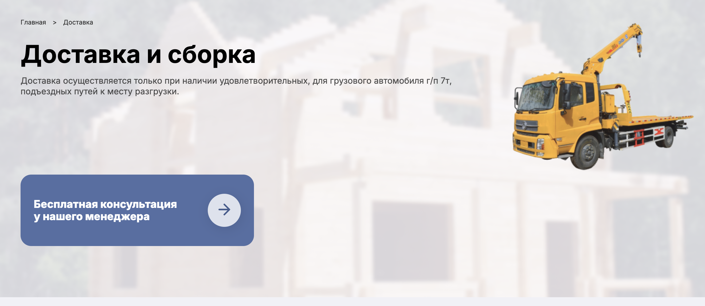
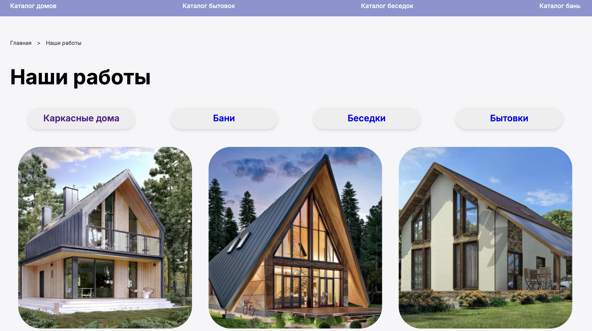

# DomStroy 🛠️🏡

**DomStroy** is a platform designed for ordering high-quality parts, materials, and custom solutions for building saunas and frame houses. The site offers an easy-to-use interface and automation via a Telegram bot for efficient customer interaction.

## Features
- 📦 **Order parts and materials**: A wide selection of building components.
- 🏠 **Custom solutions**: Tailored options for saunas and frame houses.
- 🤖 **Telegram Bot integration**: Easily manage your orders through a custom-built Python bot.

## Technologies Used
- **HTML/CSS**: For building the website's structure and styling.
- **JavaScript**: For interactive features and dynamic content.
- **Python Telegram Bot**: Handles customer inquiries and order management through Telegram.

## Getting Started

1. **Clone the repository**:
   ```bash
      git clone https://github.com/EMMMABK/DomStroy.git
   ```

2. **Navigate to the project folder**:
   ```bash
   cd domstroy
   ```

3. **Open the website locally**:
   - Open `index.html` in your web browser to view the site.
   
4. **Set up the Python Telegram Bot**:
   - Install the required Python packages:
     ```bash
     pip install -r requirements.txt
     ```
   - Configure the bot with your Telegram API token and run the script:
     ```bash
     python bot.py
     ```

## Screenshots








## Usage

- Navigate the website to browse and order building materials.
- Use the Telegram bot to track your orders or ask questions.

## Contributing

Feel free to contribute by submitting a pull request or opening an issue!

## License

This project is licensed under the MIT License.
